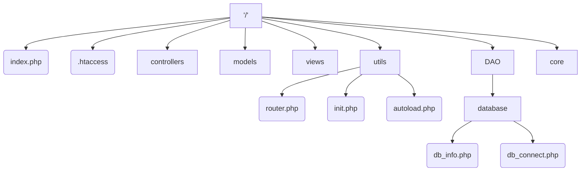

# Architecture du projet

## Contenu détaillé

| Dossier | Fichier | Contenu |
|:--:|:--:|:--|
| /utils | init.php | Contient les imports de tous les fichiers /utils nécessaires au lancement/bon fonctionnement de l'app |
